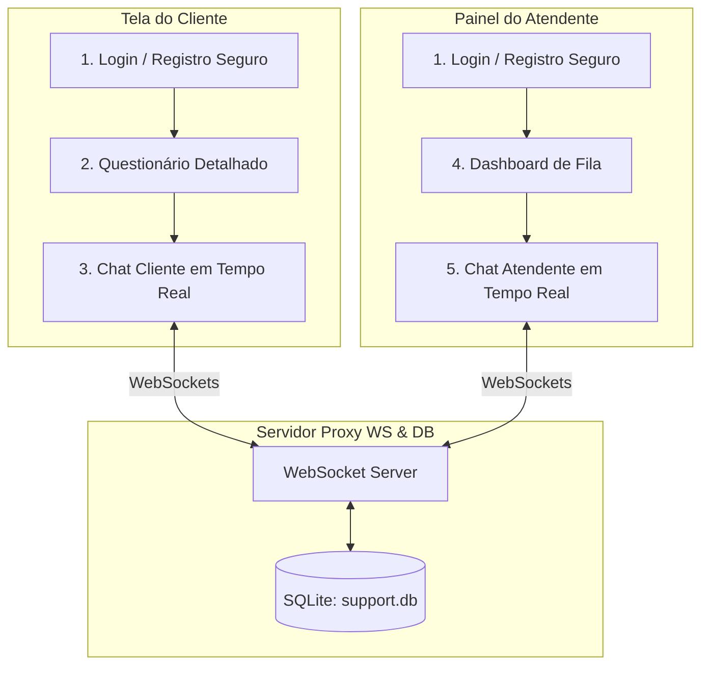

# 🚀 TriageHub - Central de Triagem com SQLite, Roteamento e Chat Multi-Usuário

Bem-vindo ao **TriageHub**, um sistema de suporte ao cliente de alto desempenho em tempo real. Esta versão traz uma evolução arquitetural robusta: o sistema funciona como uma **ponte de comunicação multi-usuário bidirecional**, persistindo todos os tickets e mensagens em um banco de dados relacional **SQLite**, navegando entre **5 páginas/rotas dinâmicas** no frontend, e realizando a **autenticação segura criptografada com Argon2** combinada a um **questionário de suporte detalhado**.

---

## 📌 Índice
1. [Sobre o Projeto](#1-sobre-o-projeto)
2. [As 5 Páginas do Frontend (Rotas)](#2-as-5-páginas-do-frontend-rotas)
3. [Segurança e Autenticação com Argon2](#3-segurança-e-autenticação-com-argon2)
4. [Persistência Relacional com SQLite](#4-persistência-relacional-com-sqlite)
5. [Questionário Estendido e Triagem IA](#5-questionário-estendido-e-triagem-ia)
    - [5.1 O Questionário Expandido do Cliente](#51-o-questionário-expandido-do-cliente)
    - [5.2 Designação Dinâmica e Fila Offline](#52-designação-dinâmica-e-fila-offline)
6. [Instalação e Execução](#6-instalação-e-execução)
    - [6.1 Executando o Servidor (Backend com Nodemon)](#61-executando-o-servidor-backend-com-nodemon)
    - [6.2 Executando o Cliente (Frontend)](#62-executando-o-cliente-frontend)
7. [Manual Prático de Testes Integrados](#7-manual-prático-de-testes-integrados)
8. [Licença](#8-licença)

---

## 1. Sobre o Projeto
O **TriageHub** soluciona o gargalo operacional de centrais de atendimento ao cliente integrando um **motor de triagem em tempo real**. À medida que novos tickets chegam, o backend analisa o conteúdo das mensagens e classifica automaticamente o nível de estresse do cliente e a prioridade de atendimento.

Toda a arquitetura é baseada em comunicação síncrona bi-direcional persistente via WebSockets e SQLite, garantindo que as mensagens de chat e os tickets de suporte permaneçam seguros e reativos em tempo real.



---

## 2. As 5 Páginas do Frontend (Rotas)
Utilizando o `react-router-dom` com `HashRouter` (100% resiliente a builds estáticos), implementamos as seguintes 5 páginas completas:

1. **Página de Autenticação (`#/`)**: Portal central unificado com toggle dinâmico entre **Login** e **Cadastro**. Solicita E-mail, Senha e, em caso de novos cadastros, o Nome Completo e o Cargo (Cliente ou Atendente).
2. **Formulário de Solicitação (`#/client/create`)**: Exclusivo para clientes. Exibe o questionário estendido com 5 perguntas detalhadas para contextualização do problema e checagem de palavras urgentes em tempo real.
3. **Chat em Tempo Real do Cliente (`#/client/chat/:ticketId`)**: Tela de atendimento, exibindo a conversa em tempo real e uma barra lateral contendo todos os dados detalhados fornecidos pelo cliente (Categoria, Título, Urgência e Relato Completo).
4. **Dashboard do Atendente (`#/operator/dashboard`)**: Painel administrativo exibindo KPIs em tempo real, filtros dinâmicos e o feed de logs de análise IA.
5. **Chat de Atendimento do Atendente (`#/operator/chat/:ticketId`)**: Tela focada de conversação ativa para o atendente, exibindo a barra lateral com as informações detalhadas e ações de encerramento do ticket.

---

## 3. Segurança e Autenticação com Argon2
Assegurando o cumprimento de diretrizes rígidas de segurança corporativa, todas as senhas de usuários são protegidas no banco de dados SQLite:
- **Hach/Salting robusto**: O backend utiliza a biblioteca `argon2` para aplicar hashing de mão única utilizando parâmetros de ponta na criptografia.
- **Login e Registro Síncronos**: Ao tentar autenticar no frontend, o WebSocket envia o payload `AUTH`. O backend verifica o email:
  - Se cadastrado, executa `argon2.verify()` na senha enviada contra o hash armazenado para validar o login.
  - Se novo, gera o hash seguro da senha via `argon2.hash()` e insere as credenciais na tabela `users` do banco SQLite.

---

## 4. Persistência Relacional com SQLite
Para garantir que nenhuma conversa, ticket ou usuário seja perdido ao reiniciar os servidores, implementamos o banco de dados **SQLite** (`support.db`) no backend com a seguinte estrutura de tabelas:

```sql
-- Tabela de Usuários Criptografada
CREATE TABLE IF NOT EXISTS users (
  email TEXT PRIMARY KEY,
  name TEXT NOT NULL,
  passwordHash TEXT NOT NULL,
  role TEXT NOT NULL
);

-- Tabela de Tickets (Questionário Expandido)
CREATE TABLE IF NOT EXISTS tickets (
  id TEXT PRIMARY KEY,
  customerName TEXT NOT NULL,
  customerEmail TEXT NOT NULL,
  channel TEXT NOT NULL,
  category TEXT NOT NULL,
  subject TEXT NOT NULL,
  description TEXT NOT NULL,
  priority TEXT NOT NULL,
  status TEXT NOT NULL,
  stressLevel INTEGER NOT NULL,
  operatorName TEXT NOT NULL,
  createdAt TEXT NOT NULL
);

-- Tabela de Mensagens de Chat
CREATE TABLE IF NOT EXISTS messages (
  id TEXT PRIMARY KEY,
  ticketId TEXT NOT NULL,
  sender TEXT NOT NULL, -- 'client' ou 'agent'
  text TEXT NOT NULL,
  timestamp TEXT NOT NULL,
  FOREIGN KEY(ticketId) REFERENCES tickets(id) ON DELETE CASCADE
);
```

---

## 5. Questionário Estendido e Triagem IA

### 5.1 O Questionário Expandido do Cliente
Para que o especialista em atendimento obtenha as informações completas sobre o caso assim que assumir o chat, o cliente preenche o seguinte formulário estendido:
1. **Título do Problema (Resumo)**: Um campo curto sintetizando o problema.
2. **Categoria do Problema**: Seleção entre `Técnico (Hardware/Software)`, `Financeiro & Cobrança`, `Dúvidas & Configurações` e `Reclamações & Cancelamento`.
3. **Urgência Autodeclarada (1 a 5)**: A percepção do cliente sobre a gravidade da situação.
4. **Canal Preferencial**: Escolha entre WhatsApp e Webchat.
5. **Descrição Detalhada do Caso**: Um texto longo relatando o ocorrido. O motor de triagem do backend escuta este campo em busca das palavras-chave de estresse (`"PROCON"`, `"cancelar"`, `"urgente"`, `"ruim"`, `"advogado"`) para determinar a prioridade automática.

### 5.2 Designação Dinâmica e Fila Offline
- **Atendente Online**: Se houver técnicos conectados (identificados após o login), o sistema atribui automaticamente um deles de forma aleatória para iniciar o chat e despacha a mensagem automática de boas-vindas do técnico.
- **Atendente Offline**: Se nenhum técnico estiver logado, o ticket é marcado como `"Aguardando Atendente"`, exibindo a mensagem automática de espera do sistema. Assim que qualquer atendente logar, ele **assumirá automaticamente** o ticket reativamente!

---

## 6. Instalação e Execução

### 6.1 Executando o Servidor (Backend com Nodemon)
1. Acesse o diretório `server`:
   ```bash
   cd server
   ```
2. Instale as dependências (que agora incluem `argon2` e `sqlite3`):
   ```bash
   npm install
   ```
3. Inicie o servidor WebSocket com suporte a hot-reload:
   ```bash
   npm run dev
   ```
   *O arquivo `support.db` será criado no diretório `server/` e as tabelas serão instanciadas automaticamente.*

> [!TIP]
> Caso você tenha rodado versões anteriores do projeto, pare o processo do servidor e apague o arquivo `server/support.db` para que a nova tabela de usuários e colunas expandidas sejam criadas de forma limpa!

---

### 6.2 Executando o Cliente (Frontend)
1. Abra um segundo terminal e acesse a pasta `client`:
   ```bash
   cd client
   ```
2. Instale as dependências do frontend:
   ```bash
   npm install
   ```
3. Inicie o servidor do Vite:
   ```bash
   npm run dev
   ```
4. Abra o endereço no navegador (geralmente `http://localhost:5173`).

---

## 7. Manual Prático de Testes Integrados

Para testar a segurança do Argon2 e a exibição rica de dados no chat:

1. **Faça um Novo Cadastro**:
   - Acesse a URL no navegador. Clique em *"Ainda não tem conta? Cadastre-se"*.
   - Digite um E-mail (`carlos@cliente.com`), Senha (`senha123`), Nome (`Carlos Cliente`) e escolha o papel **Cliente**. Clique em cadastrar. 
   - O backend salvará no SQLite o hash criptografado com Argon2.
2. **Responda ao Questionário Detalhado**:
   - Pedro será redirecionado para a criação de suporte. Preencha a Categoria (*Financeiro*), Título (*Cobrança Duplicada*), escolha Urgência *4/5*, Canal *WhatsApp* e descreva detalhadamente o caso no campo longo.
   - Envie. Pedro será levado para o chat.
3. **Abra outro navegador e faça Login do Técnico**:
   - No segundo navegador, acesse a URL. Crie uma conta ou faça login como Atendente: E-mail (`alexandre@tecnico.com`), Senha (`senha456`), Nome (`Técnico Alexandre`).
   - Alexandre se conectará e assumirá Pedro automaticamente em tempo real!
4. **Confirmação Visual Rica**:
   - Em ambos os navegadores, no chat, observe a barra lateral esquerda preenchida com **toda a descrição do questionário estendido** (Categoria Financeiro, Urgência 4/5, Título do Problema e Relato Completo Pedro). Isso garante total clareza no atendimento operacional!

---

## 8. Licença
Este software é fornecido livremente sob a [Licença MIT](LICENSE).
