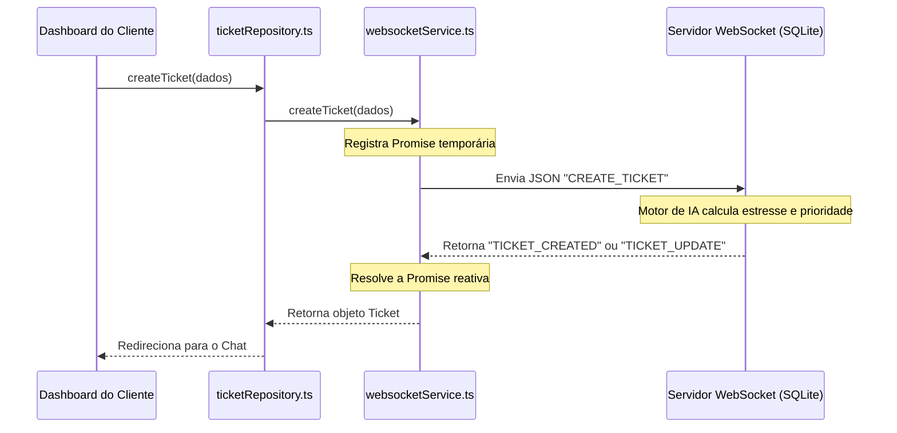

# 🚀 TriageHub - Central de Triagem Inteligente em Tempo Real

O **TriageHub** é uma solução de suporte ao cliente de alto desempenho em tempo real, operando com comunicação bidirecional persistente via WebSockets e armazenamento relacional em banco de dados SQLite.

O sistema integra um **motor de triagem de IA** que avalia o nível de estresse do cliente e a gravidade dos relatos em tempo real para priorizar a fila de atendimento dos especialistas. A segurança é assegurada por meio de criptografia forte utilizando hashes **Argon2** no backend.

---

## 🏗️ Arquitetura do Projeto

Ambas as partes do projeto foram refatoradas seguindo as diretrizes da **Clean Architecture** (Arquitetura Limpa), permitindo total desacoplamento entre regras de negócio, infraestrutura de rede, banco de dados e componentes de visualização.

```text
TriageHub/
├── client/                     # Portal web desenvolvido em React 19 + TypeScript
│   ├── src/
│   │   ├── core/               # Camada Domain (Entidades de Negócio)
│   │   ├── data/               # Camada Data (WebSocket datasource e Repositório)
│   │   ├── store/              # Camada State (Estado global Zustand)
│   │   └── presentation/       # Camada Presentation (Componentes, Controllers e Pages)
│   └── structure.md            # Documentação detalhada da estrutura e fluxo do cliente
│
└── server/                     # Servidor WebSocket desenvolvido em Node.js com SQLite
    ├── src/
    │   ├── core/               # Camada Domain (Usecases, Entidades e Contratos)
    │   ├── infrastructure/     # Camada Infrastructure (Conexão DB, Repositórios, Segurança)
    │   └── presentation/       # Camada Presentation (Controllers de entrada WS e Server)
    └── structure.md            # Documentação detalhada da estrutura e APIs do servidor
```

> [!NOTE]
> Para obter detalhes aprofundados sobre a organização de arquivos, diagramas de sequência de fluxos de login, chamados e chat, e o funcionamento das camadas de software:
> * Leia a **[Documentação do Frontend (Cliente)](file:///d:/git_clones/TriageHub/client/structure.md)**
> * Leia a **[Documentação do Backend (Servidor)](file:///d:/git_clones/TriageHub/server/structure.md)**

---

## ⚙️ Fluxo de Dados e Comunicação em Tempo Real

A comunicação baseia-se em um canal persistente via WebSocket (`ws://localhost:8080`).



---

## 🚀 Como Executar o Projeto

### Pré-requisitos
* Node.js (versão 18 ou superior)
* npm (gerenciador de pacotes padrão)

---

### 1. Executando o Servidor (Backend)

1. Acesse o diretório `server`:
   ```bash
   cd server
   ```
2. Instale as dependências:
   ```bash
   npm install
   ```
3. Inicie o servidor:
   ```bash
   npm run dev
   ```
   *O arquivo do banco de dados `support.db` (SQLite) será gerado automaticamente no diretório `server/` se não existir, instanciando todas as tabelas e relacionamentos.*

---

### 2. Executando o Cliente (Frontend)

1. Acesse o diretório `client`:
   ```bash
   cd client
   ```
2. Instale as dependências:
   ```bash
   npm install
   ```
3. Inicie o servidor de desenvolvimento do Vite:
   ```bash
   npm run dev
   ```
4. Acesse a URL fornecida pelo Vite no navegador (ex: `http://localhost:5173`).

---

## 🛠️ Tecnologias Utilizadas

### Frontend (`client/`)
* **React 19 & TypeScript**: Interface reativa e fortemente tipada.
* **Vite**: Build tooling ultrarrápido para desenvolvimento frontend.
* **Tailwind CSS v4**: Estilização moderna e utilitária integrada.
* **Zustand v5**: Gerenciamento de estado global otimizado.
* **Lucide React**: Biblioteca de ícones modernos.
* **React Router DOM v7**: Controle de rotas dinâmicas e segurança via `HashRouter`.

### Backend (`server/`)
* **Node.js & ws**: Servidor de WebSockets de alta velocidade.
* **SQLite3**: Banco de dados relacional leve e embutido para persistência segura de dados.
* **Argon2**: Algoritmo moderno e recomendado para criptografia segura de senhas.

---

## 📖 Fluxo de Teste Prático

Para testar a comunicação em tempo real, o motor de triagem IA e a segurança com Argon2:

1. **Abra duas abas ou janelas de navegador diferentes** (preferencialmente uma delas em modo anônimo).
2. **Janela A: Cadastre e Logue um Cliente**
   - Acesse `http://localhost:5173`.
   - Clique em *"Cadastre-se"*, digite os dados e selecione o cargo **Cliente**.
   - Abra um novo ticket.
3. **Janela B: Cadastre e Logue um Atendente/Operador**
   - Na janela anônima, faça o cadastro como **Atendente**.
   - Você entrará no painel de controle operacional. O chamado do cliente da **Janela A** aparecerá no topo da fila (na barra lateral de solicitações propostas).
   - Clique em **Aceitar Atendimento**. A conversa em tempo real começará instantaneamente em ambas as telas!

---

## 📄 Licença
Este projeto é distribuído livremente sob a [Licença MIT](LICENSE).
