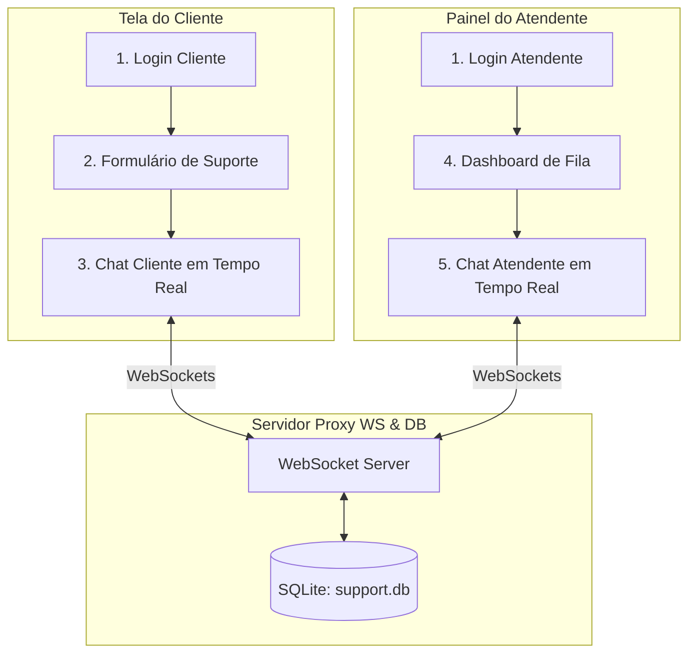

# 🚀 TriageHub - Central de Triagem com SQLite, Roteamento e Chat Multi-Usuário

Bem-vindo ao **TriageHub**, um sistema de suporte ao cliente de alto desempenho em tempo real. Esta versão traz uma evolução arquitetural robusta: o sistema funciona como uma **ponte de comunicação multi-usuário bidirecional**, persistindo todos os tickets e mensagens em um banco de dados relacional **SQLite**, navegando entre **5 páginas/rotas dinâmicas** no frontend, e realizando a **designação dinâmica de técnicos conectados** em tempo real com suporte a **nodemon** no backend.

---

## 📌 Índice
1. [Sobre a Nova Arquitetura](#1-sobre-a-nova-arquitetura)
2. [As 5 Páginas do Frontend (Rotas)](#2-as-5-páginas-do-frontend-rotas)
3. [Persistência Relacional com SQLite](#3-persistência-relacional-com-sqlite)
4. [Lógica de Triagem e Designação Dinâmica de Técnicos](#4-lógica-de-triagem-e-designação-dinâmica-de-técnicos)
    - [4.1 Técnicos Ativos e Identificação](#41-técnicos-ativos-e-identificação)
    - [4.2 Atribuição Inteligente e Fila de Espera Offline](#42-atribuição-inteligente-e-fila-de-espera-offline)
    - [4.3 Captura Automática de Tickets (Auto-Pickup)](#43-captura-automática-de-tickets-auto-pickup)
5. [Instalação e Execução (com Nodemon)](#5-instalação-e-execução-com-nodemon)
    - [5.1 Executando o Servidor (Backend com Nodemon)](#51-executando-o-servidor-backend-com-nodemon)
    - [5.2 Executando o Cliente (Frontend)](#52-executando-o-cliente-frontend)
6. [Detalhamento Técnico de Código](#6-detalhamento-técnico-de-código)
7. [Manual Prático de Testes Multi-Usuário](#7-manual-prático-de-testes-multi-usuário)
8. [Licença](#8-licença)

---

## 1. Sobre a Nova Arquitetura
Diferente de uma fila de visualização estática, esta arquitetura funciona como uma verdadeira ponte bi-direcional. Um cliente faz login e abre uma solicitação de suporte. O sistema executa a triagem automática de estresse, designa um técnico ativo disponível da equipe de atendimento e cria uma conversa em tempo real. O atendente, ao acessar o painel administrativo, visualiza o ticket na sua fila e atende o cliente de forma síncrona.



---

## 2. As 5 Páginas do Frontend (Rotas)
Utilizando o `react-router-dom` com `HashRouter` (100% resiliente a builds estáticos), implementamos as seguintes 5 páginas completas:

1. **Página de Login (`#/`)**: Portal central unificado. O usuário digita seu nome e seleciona se é **Cliente** ou **Atendente**, garantindo controle de sessões e rotas.
2. **Formulário de Solicitação (`#/client/create`)**: Exclusivo para clientes. Conta com um **motor visual reativo de detecção de urgência**: ao digitar palavras como *"PROCON"*, *"urgente"* ou *"cancelar"*, um aviso pulsante informa dinamicamente que o suporte será classificado como prioritário.
3. **Chat em Tempo Real do Cliente (`#/client/chat/:ticketId`)**: Tela limpa e focada no cliente, mostrando os dados do suporte e o chat bi-direcional. Exibe imediatamente a mensagem de boas-vindas do atendente.
4. **Dashboard do Atendente (`#/operator/dashboard`)**: Visão operacional com KPIs em tempo real (total acumulado no banco de dados SQLite, tickets em espera, nível de estresse médio da fila), filtros por canal de entrada e um feed de logs em tempo real do motor de triagem.
5. **Chat de Atendimento do Atendente (`#/operator/chat/:ticketId`)**: Tela focada de conversação do atendente, com visualização do estresse do cliente em tempo real, painel de histórico de mensagens e ação rápida de finalizar/resolver o ticket no banco de dados SQLite.

---

## 3. Persistência Relacional com SQLite
Para garantir que nenhuma conversa ou ticket seja perdido ao reiniciar os servidores, implementamos o banco de dados **SQLite** (`support.db`) no backend com a seguinte estrutura de tabelas:

```sql
-- Tabela de Tickets
CREATE TABLE IF NOT EXISTS tickets (
  id TEXT PRIMARY KEY,
  customerName TEXT NOT NULL,
  channel TEXT NOT NULL,
  subject TEXT NOT NULL,
  priority TEXT NOT NULL,
  status TEXT NOT NULL,
  stressLevel INTEGER NOT NULL,
  operatorName TEXT NOT NULL,
  createdAt TEXT NOT NULL
);

-- Tabela de Mensagens de Chat
CREATE TABLE IF NOT EXISTS messages (
  id TEXT PRIMARY KEY,
  ticketId TEXT NOT NULL,
  sender TEXT NOT NULL, -- 'client' ou 'agent'
  text TEXT NOT NULL,
  timestamp TEXT NOT NULL,
  FOREIGN KEY(ticketId) REFERENCES tickets(id) ON DELETE CASCADE
);
```

Ao iniciar, o backend cria automaticamente o arquivo `support.db` no diretório do servidor.

---

## 4. Lógica de Triagem e Designação Dinâmica de Técnicos

### 4.1 Técnicos Ativos e Identificação
O backend não faz mais uso de uma lista de nomes estática. Em vez disso, o frontend utiliza o evento reativo `IDENTIFY` do WebSocket:
- Assim que o atendente faz login, o cliente React envia a identificação `{ type: "IDENTIFY", data: { name, role: 'agent' } }`.
- O servidor rastreia as conexões ativas identificadas como atendentes e as armazena dinamicamente na lista de especialistas online.

### 4.2 Atribuição Inteligente e Fila de Espera Offline
Quando um novo cliente cria um pedido de suporte:
- **Técnicos Online**: Se houver um ou mais técnicos conectados, o sistema escolhe **automaticamente um deles de forma aleatória** para assumir o suporte. O atendente selecionado envia a mensagem automática de apresentação personalizada:
  > *"Olá! Eu sou o técnico [Nome do Técnico] e acabo de ser designado para o seu suporte. Como posso te auxiliar com o seu pedido de atendimento?"*
- **Técnicos Offline**: Caso **não haja nenhum atendente online** no momento em que o ticket é criado:
  - O ticket é salvo na base SQLite com o status de atendente definido como `"Aguardando Atendente"`.
  - O cliente recebe uma mensagem de sistema automática instruindo-o a aguardar:
    > *"Olá! Agradecemos o seu contato. No momento, todos os nossos especialistas estão offline. Por favor, aguarde um momento que o primeiro técnico disponível que se conectar assumirá o seu atendimento!"*

### 4.3 Captura Automática de Tickets (Auto-Pickup)
Quando um atendente se conecta e faz login no sistema:
- O backend identifica que o atendente está online e busca na base SQLite por qualquer ticket ativo que esteja no status `"Aguardando Atendente"`.
- O novo atendente **assume automaticamente esses tickets em espera**.
- O sistema atualiza o nome do operador do ticket na base de dados e gera uma mensagem automática na tela do cliente notificando o início do suporte:
  > *"Olá! Eu sou o técnico [Nome do Novo Técnico] e acabo de assumir o seu suporte. Como posso te auxiliar com o seu pedido de atendimento?"*

---

## 5. Instalação e Execução (com Nodemon)

### 5.1 Executando o Servidor (Backend com Nodemon)
1. Acesse o diretório `server`:
   ```bash
   cd server
   ```
2. Instale as dependências (SQLite e biblioteca WS):
   ```bash
   npm install
   ```
3. Inicie o servidor em ambiente de desenvolvimento utilizando o **Nodemon** (que recarrega o servidor a cada alteração de arquivo):
   ```bash
   npm run dev
   ```
   *O console informará que o Nodemon está monitorando as modificações e que o SQLite iniciou com sucesso.*

---

### 5.2 Executando o Cliente (Frontend)
1. Abra um segundo terminal e acesse a pasta `client`:
   ```bash
   cd client
   ```
2. Instale as dependências do frontend:
   ```bash
   npm install
   ```
3. Inicie o servidor do Vite:
   ```bash
   npm run dev
   ```
4. Abra o endereço no navegador (geralmente `http://localhost:5173`).

---

## 6. Detalhamento Técnico de Código

### Frontend:
- **`client/src/App.tsx`**: Gerencia o roteamento das 5 páginas do frontend unificadas com `HashRouter` e estilizadas com Tailwind CSS v4.
- **`client/src/hooks/useWebSocket.ts`**: Atualizado com o `useEffect` de auto-identificação bi-direcional. Envia o `IDENTIFY` ao conectar se o atendente/cliente estiver logado na store.
- **`client/src/store/useTicketStore.ts`**: Estado Zustand contendo dados do usuário conectado para separação lógica e controle de acessibilidade a rotas.

### Backend:
- **`server/server.js`**: Banco de dados relacional com promessas SQLite e lógica síncrona de WebSockets para escuta e alteração de tabelas de mensagens e designação automática e pickups retroativos de atendentes.

---

## 7. Manual Prático de Testes Multi-Usuário

Para validar a integridade da persistência e a lógica dinâmica de atendentes offline e pickup automático, siga estes passos:

1. **Inicie o servidor de banco de dados** via Nodemon (`npm run dev` na pasta `server`).
2. **Cenário 1: Cliente Abre Suporte Sem Atendentes Online**
   - Acesse o cliente no navegador, logue-se como **Cliente (Pedro)**.
   - Envie um formulário de suporte com o assunto *"Preciso de suporte técnico"*.
   - Você será levado ao chat e verá a **mensagem automática de espera** informando que nenhum técnico está online no momento. O atendente constará como `"Aguardando Atendente"`.
3. **Cenário 2: Técnico Conecta e Assume Automaticamente (Auto-Pickup)**
   - Em outro navegador ou aba anônima na mesma URL, faça login como **Atendente (Técnico Alexandre)**.
   - Assim que você logar, o backend identificará Alexandre e atualizará o ticket de Pedro de forma reativa.
   - Na tela do Pedro (cliente), o nome do atendente mudará instantaneamente de *"Aguardando Atendente"* para *"Técnico Alexandre"* e aparecerá a mensagem automática: *"Olá! Eu sou o técnico Técnico Alexandre e acabo de assumir o seu suporte..."*.
   - Na tela de Alexandre (atendente), o ticket de Pedro aparecerá automaticamente no Dashboard como *"Meu Atendimento"*.
4. **Cenário 3: Fila com Múltiplos Técnicos**
   - Logue outro técnico, por exemplo **Técnica Marina**, em um terceiro navegador.
   - Abra um novo ticket com outro cliente, por exemplo **Cliente (Maria)**.
   - O backend selecionará de forma aleatória e automática entre Alexandre e Marina para assumir a nova conversa, disparando o chat em tempo real e mantendo todos os históricos salvos em seu arquivo de banco de dados local `support.db`!

---

## 8. Licença
Este software é fornecido livremente sob a [Licença MIT](LICENSE).
