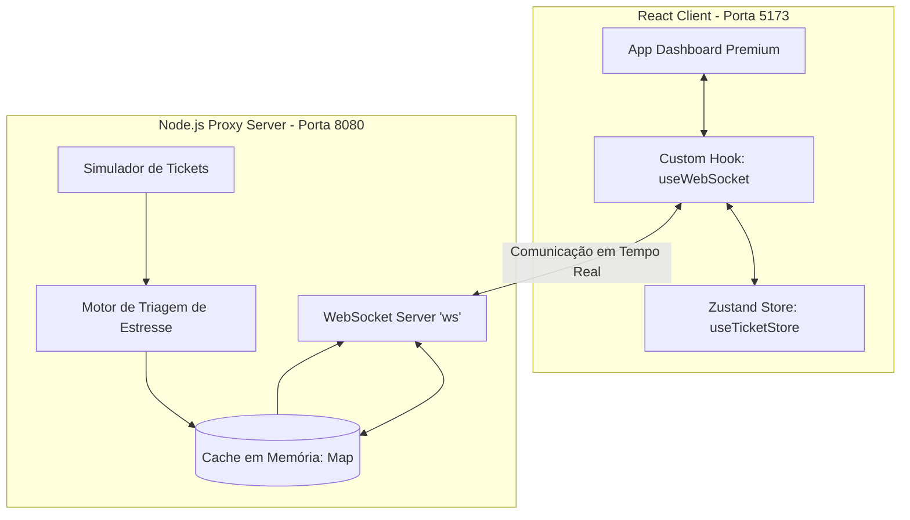

# 🚀 TriageHub - Central de Triagem Automatizada de Suporte ao Cliente

Bem-vindo ao **TriageHub**, um sistema completo e de alto desempenho projetado para a triagem automatizada, classificação e atendimento a clientes em tempo real. Este projeto foi desenvolvido como **Trabalho Final de Framework de Frontend**, utilizando tecnologias modernas e eficientes no lado do cliente e um proxy de rede via WebSocket resiliente no backend.

---

## 📌 Índice
1. [Sobre o Projeto](#1-sobre-o-projeto)
2. [Arquitetura do Sistema](#2-arquitetura-do-sistema)
3. [Estrutura de Diretórios](#3-estrutura-de-diretórios)
4. [Requisitos Prévios](#4-requisitos-prévios)
5. [Instalação e Execução](#5-instalação-e-execução)
    - [5.1 Executando o Servidor (Backend)](#51-executando-o-servidor-backend)
    - [5.2 Executando o Cliente (Frontend)](#52-executando-o-cliente-frontend)
6. [Regras de Negócio e Triagem Automatizada](#6-regras-de-negócio-e-triagem-automatizada)
7. [Detalhamento Tecnológico (Frontend & Backend)](#7-detalhamento-tecnológico-frontend--backend)
8. [Manual de Testes do Operador](#8-manual-de-testes-do-operador)
9. [Licença](#9-licença)

---

## 1. Sobre o Projeto
O **TriageHub** soluciona o gargalo operacional de centrais de atendimento ao cliente integrando um **motor de triagem em tempo real**. À medida que novos tickets chegam via canais como WhatsApp ou Webchat, o backend analisa o conteúdo das mensagens e classifica automaticamente o nível de estresse do cliente e a prioridade de atendimento.

No frontend, a fila de atendimento é atualizada instantaneamente via WebSockets e organizada de forma dinâmica, garantindo que os clientes mais críticos e estressados sejam exibidos no topo para atendimento prioritário por parte dos operadores.

---

## 2. Arquitetura do Sistema
O sistema é constituído por duas partes principais integradas de forma bi-direcional:



- **Backend (Servidor)**: Proxy WebSocket escrito em Node.js puro usando a biblioteca `ws`. Mantém o estado da fila de tickets ativos em cache (memória local) e simula o fluxo bi-direcional de entrada e resposta de tickets.
- **Frontend (Cliente)**: Aplicação construída com React 19+, TypeScript estrito (zero `any`), empacotada com Vite, gerenciamento de estado global reativo com Zustand e estilizada com o moderno ecossistema Tailwind CSS v4.

---

## 3. Estrutura de Diretórios
A base de código está dividida em duas pastas isoladas no diretório raiz:

```
c:/git_clones/fdfe/
├── client/                     # Aplicação Frontend React
│   ├── src/
│   │   ├── types/
│   │   │   └── ticket.ts       # Modelagem de dados e tipos estritos do TS
│   │   ├── store/
│   │   │   └── useTicketStore.ts # Gerenciador de estado global (Zustand)
│   │   ├── hooks/
│   │   │   └── useWebSocket.ts # Hook de controle e reconexão WebSocket
│   │   ├── App.tsx             # Painel Visual de Controle e Atendimento
│   │   ├── index.css           # Estilos globais e injeção do Tailwind CSS v4
│   │   └── main.tsx            # Inicializador da aplicação React
│   ├── vite.config.ts          # Arquivo de configuração de build e plugins
│   └── package.json            # Dependências e scripts do Frontend
│
├── server/                     # Proxy Backend Node.js
│   ├── server.js               # Servidor WebSocket principal e motor de triagem
│   └── package.json            # Dependências e scripts do Servidor
│
├── README.md                   # Este guia completo do usuário
└── LICENSE                     # Licença do projeto
```

---

## 4. Requisitos Prévios
Antes de iniciar os projetos, certifique-se de ter instalado em sua máquina:
- **Node.js**: Versão 18.0.0 ou superior (Recomendado LTS)
- **npm**: Versão 9.0.0 ou superior (geralmente instalado junto ao Node.js)

---

## 5. Instalação e Execução

Para rodar a aplicação localmente de maneira correta, é essencial executar tanto o servidor (backend) quanto o cliente (frontend) em terminais paralelos.

### 5.1 Executando o Servidor (Backend)
1. Abra um terminal e acesse a pasta `server`:
   ```bash
   cd server
   ```
2. Instale as dependências requeridas (apenas `ws` e ferramentas de desenvolvimento):
   ```bash
   npm install
   ```
3. Inicie o servidor:
   ```bash
   npm start
   ```
   Você receberá a confirmação de que o servidor está pronto para conexões:
   ```text
   🚀 Servidor Proxy WebSocket rodando na porta 8080
   ```

---

### 5.2 Executando o Cliente (Frontend)
1. Abra um **segundo terminal** e acesse a pasta `client`:
   ```bash
   cd client
   ```
2. Instale todas as dependências do frontend (incluindo Zustand, Lucide Icons e Tailwind):
   ```bash
   npm install
   ```
3. Inicie o servidor de desenvolvimento do Vite:
   ```bash
   npm run dev
   ```
4. O terminal exibirá o endereço local da aplicação. Abra-o no seu navegador (normalmente `http://localhost:5173`).

---

## 6. Regras de Negócio e Triagem Automatizada

### Motor de Triagem IA (Backend)
O simulador do servidor gera um novo ticket a cada **10 segundos** de forma contínua a partir dos canais WhatsApp ou Webchat. Cada ticket passa por uma triagem automatizada imediata sob as seguintes regras:
- **Palavras-chave de Estresse**: O motor busca pelas palavras `"PROCON"`, `"cancelar"`, `"urgente"`, `"ruim"` e `"advogado"` (busca case-insensitive).
- **Classificação Crítica**: Caso o ticket contenha alguma dessas palavras no texto ou assunto:
  - A prioridade é definida de forma emergencial como `'critical'` ou `'high'`.
  - O nível de estresse do cliente é cravado na escala máxima (`5`).
  - O console do servidor emite um alerta luminoso de urgência.
- **Classificação Padrão**: Caso não haja palavras-chave de estresse:
  - A prioridade é definida entre `'low'` e `'medium'`.
  - O nível de estresse é calculado de forma aleatória em uma escala de suavidade de `1` a `3`.

### Classificação e Ordenação Reativa (Frontend)
Na interface do operador de suporte, a Zustand store atua como o cérebro organizacional da fila de atendimento. Sempre que um ticket é recebido, atualizado ou respondido, a lista é reordenada estritamente pela seguinte prioridade:
1. **Prioridade Crítica**: Todos os tickets triados como `'critical'` são posicionados imediatamente no topo da fila, independente de outros fatores.
2. **Nível de Estresse (Decrescente)**: Em seguida, os tickets são organizados do maior nível de estresse (`5`) ao menor (`1`).
3. **Hierarquia de Prioridades**: Em seguida, o ordenamento segue a relevância da prioridade (`high` > `medium` > `low`).
4. **Data de Criação**: Havendo empate em todos os critérios, os tickets mais recentes criados no servidor são exibidos no topo (ordem cronológica reversa).

---

## 7. Detalhamento Tecnológico (Frontend & Backend)

### Frontend (React + Zustand + TypeScript)
- **Zustand Store (`useTicketStore.ts`)**: Estado leve e reativo. Armazena o estado dinâmico dos tickets, a seleção de chat ativa do operador, controle de conexão com o socket, além de armazenar um histórico visual de logs de triagem com rolagem infinita.
- **Custom Hook Resiliente (`useWebSocket.ts`)**: Controla a conexão com a API de WebSocket nativa do navegador. Emprega a declaração de singleton do socket fora do escopo do hook React. Isso resolve definitivamente o problema recorrente do **React StrictMode** que cria conexões duplicadas em ambiente local de desenvolvimento. Além disso, implementa um algoritmo de auto-reconexão com tempo de espera de 3 segundos em caso de queda do servidor.
- **Estilização Moderna (Tailwind CSS v4)**: A interface faz uso de efeitos visuais premium de glassmorphism escuro, sombras suaves, scrollbars customizadas e animações pulsantes para captar a atenção do operador em tickets que exigem urgência.

### Backend (Node.js)
- **Proxy WebSocket Nativo (`server.js`)**: Escrito em JavaScript moderno (ES Modules). Ouve os eventos do tipo `AGENT_REPLY` vindos do React, anexa a resposta do agente com timestamp no ticket correto, reduz o estresse do cliente em -1 (simulando a satisfação do cliente ao ser atendido) e retransmite a fila atualizada instantaneamente a todos os operadores conectados.

---

## 8. Manual de Testes do Operador

Para validar os requisitos do projeto e comprovar a estabilidade de rede em tempo real, execute a seguinte sequência de ações no navegador:

1. **Validação de Conexão**:
   - Abra a página no navegador. No topo direito, certifique-se de que o badge verde pulsante exibe `"Servidor Conectado"`.
   - Se você fechar o terminal do servidor, o frontend mudará instantaneamente para `"Desconectado"` e entrará em contagem de reconexão. Ao reabrir o servidor, a conexão reestabelecerá de forma transparente.

2. **Fluxo de Triagem Automatizada**:
   - Aguarde o simulador backend gerar novos tickets na lista lateral a cada 10 segundos.
   - Observe a entrada de tickets marcados com badge vermelho pulsante `"Crítico"`, nível de estresse `"5/5"` e barra vermelha. Note que eles passam na frente de todos os outros e se fixam no topo da fila.
   - Abra a aba de logs no painel direito `"Triagem em Ação"` e confirme a identificação de palavras-chave como *"PROCON"*, *"cancelar"* ou *"advogado"*.

3. **Atendimento e Resposta em Tempo Real**:
   - Clique em qualquer ticket na fila lateral para abrir o chat de atendimento.
   - Digite uma resposta na barra inferior e envie.
   - Veja o chat atualizar e a mensagem do operador aparecer imediatamente com o balão na cor azul e badge de status do ticket mudar para `"Em Progresso"`.
   - Clique no botão `"Resolver"` no canto superior direito para finalizar o ticket de suporte. A interface enviará uma mensagem de finalização automatizada e o ticket será arquivado como `"Resolvido"`, reduzindo o estresse para nível 1.

---

## 9. Licença
Este projeto é de código aberto e está licenciado sob a [Licença MIT](LICENSE). Sinta-se livre para utilizar, modificar e distribuir conforme as diretrizes acadêmicas.
