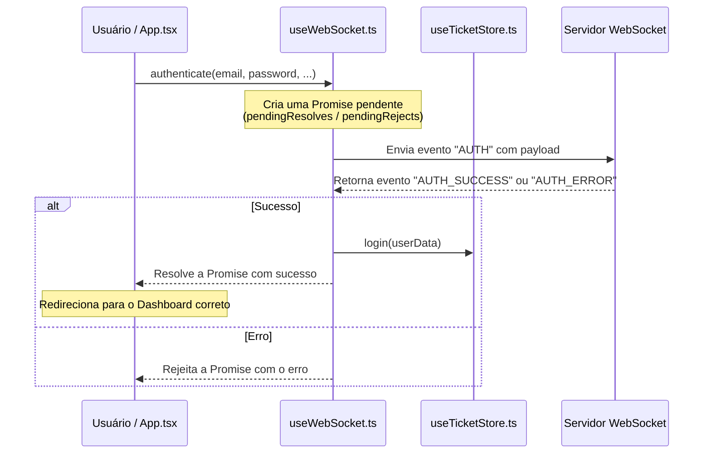
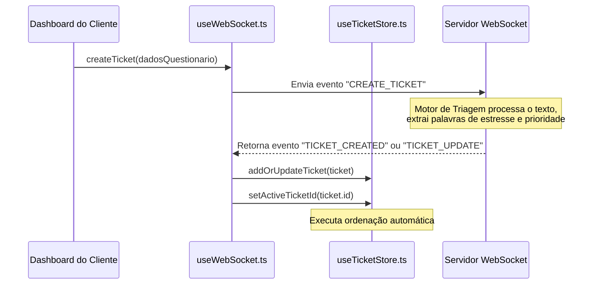

# Estrutura e Fluxo de Dados do Frontend (Cliente)

Este documento descreve a arquitetura, a organização dos arquivos e o fluxo de dados em tempo real da pasta `client` (frontend) do **TriageHub**.

---

## 📁 Estrutura de Diretórios e Arquivos

O frontend é construído com **React**, **TypeScript**, **Vite**, **Tailwind CSS**, **Zustand** (gerenciamento de estado) e **WebSockets** (comunicação em tempo real).

Abaixo está o mapeamento dos principais arquivos e pastas dentro de `client/`:

```text
client/
├── public/                  # Assets públicos estáticos (ex: favicon)
├── src/
│   ├── assets/              # Imagens e logotipos (ex: logo.png)
│   ├── hooks/
│   │   └── useWebSocket.ts  # Gerenciamento da conexão WebSocket e chamadas seguras por Promessas
│   ├── store/
│   │   └── useTicketStore.ts# Estado global com Zustand (Autenticação, Tickets, Logs e Conexão)
│   ├── types/
│   │   └── ticket.ts        # Tipagens TypeScript para Tickets, Mensagens e Logs de Triagem
│   ├── App.css              # Customizações pontuais de estilos
│   ├── App.tsx              # Componente central, roteador e views (Login, Dashboards, Chat, etc.)
│   ├── index.css            # Folha de estilos global integrada ao Tailwind CSS
│   └── main.tsx             # Ponto de entrada do React
├── eslint.config.js         # Configurações de linting com ESLint
├── index.html               # Página HTML raiz
├── package.json             # Dependências e scripts do projeto
├── tsconfig.json            # Configuração do TypeScript
└── vite.config.ts           # Configuração de build e plugins do Vite
```

---

## ⚙️ Fluxo de Dados e Comunicação em Tempo Real

A comunicação do **TriageHub** baseia-se em um modelo assíncrono e bidirecional orientado a eventos via **WebSocket**. Não há requisições HTTP REST tradicionais para a gestão de dados; tudo trafega através de um único canal persistente com o servidor (`ws://localhost:8080`).

### 1. Inicialização e Conectividade
* Ao carregar a aplicação, o hook `useWebSocket` inicia a conexão com o servidor WebSocket.
* O estado da conexão é reativamente sincronizado no estado global `isConnected` (Zustand).
* Se a conexão cair, o hook tenta reconectar automaticamente a cada 3 segundos.

### 2. Fluxo de Autenticação (Login / Cadastro)


### 3. Fluxo de Criação e Triagem IA de Tickets


### 4. Algoritmo de Ordenação na Fila de Atendimento
Sempre que a lista de tickets sofre alteração, o método `sortTickets` na `useTicketStore` ordena a fila de atendimento sob as seguintes regras de prioridade:
1. **Críticos Primeiro**: Tickets com `priority === 'critical'` sempre ficam no topo absoluto.
2. **Nível de Estresse Decrescente**: Em seguida, ordena-se pelo nível de estresse detectado por IA (escala de 1 a 5, onde 5 tem prioridade máxima).
3. **Hierarquia de Prioridades Nominais**: Em caso de empate de estresse, a ordenação segue `high` > `medium` > `low`.
4. **Tempo de Criação**: Havendo empates nos fatores acima, os tickets mais recentes são priorizados.

---

## 🛠️ Detalhamento dos Componentes de Código

### 1. `types/ticket.ts`
Define os contratos estritos de dados utilizados em todo o frontend:
* **`TicketPriority`**: Valores literais (`low`, `medium`, `high`, `critical`).
* **`TicketStatus`**: Estados do ciclo de vida do ticket (`open`, `in_progress`, `resolved`, `pending_acceptance`).
* **`Ticket`**: Representação de um atendimento (contém metadados, nível de estresse, mensagens trocadas, canal como `WhatsApp` ou `Webchat`, etc.).
* **`Message`**: Cada mensagem enviada/recebida no chat.
* **`TriageLog`**: Histórico detalhado de palavras-chave detectadas pela triagem e decisões do motor de IA.

### 2. `store/useTicketStore.ts`
Estado centralizado global gerenciado pelo **Zustand**:
* **Estado**: `currentUser`, lista completa de `tickets`, `activeTicketId`, `triageLogs` e flag de conexão `isConnected`.
* **Ações**: Manipuladores de login/logout, atualização incremental de tickets via `addOrUpdateTicket`, inserção de logs e reordenação instantânea da fila utilizando `sortTickets`.

### 3. `hooks/useWebSocket.ts`
Ponte de comunicação bidirecional de baixo nível:
* Mantém referências persistentes para a conexão global em WebSocket (`globalWs`).
* Converte a natureza assíncrona do WebSocket em **Promises do JavaScript** (armazenando retornos em `pendingResolves` e `pendingRejects`), permitindo que as ações no componente (`App.tsx`) usem `await authenticate(...)` ou `await createTicket(...)` de forma limpa.
* Ouve e despacha eventos como `INITIAL_STATE`, `TICKET_CREATED`, `TICKET_UPDATE` e `AUTH_SUCCESS` diretamente para o Zustand.

### 4. `App.tsx`
Componente mestre monolítico contendo a inteligência de visualização e rotas:
* **Roteamento**: Usa `HashRouter` estruturando as telas de Login/Cadastro (`/`), Central do Cliente (`/client/dashboard`), Criação de Ticket (`/client/create`), Chat do Cliente (`/client/chat/:ticketId`) e o Painel do Operador/Atendente (`/operator/dashboard`).
* **Micro-interações e Temas**: Suporte a Dark Mode completo via classe `.dark` no elemento raiz HTML.
* **Inteligência Reativa**: Alerta visual dinâmico durante a digitação caso o cliente digite palavras de estresse configuradas (ex: *cancelar*, *procon*, *urgente*, *advogado*), avisando-o que a triagem prioritária de IA foi engajada.
