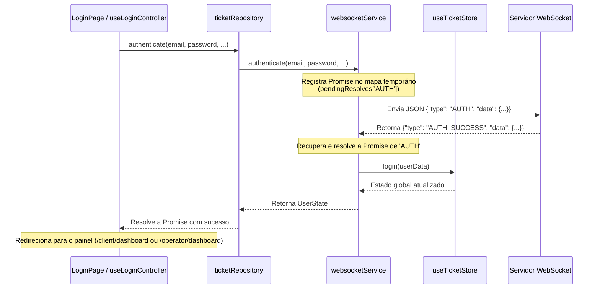
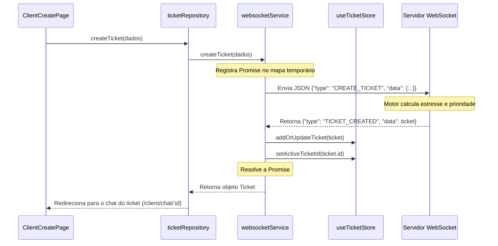

# 🏗️ Arquitetura e Fluxo de Dados do Frontend (Cliente)

Este documento descreve a arquitetura baseada nos princípios de **Clean Architecture** (Arquitetura Limpa), a organização dos arquivos e o fluxo de dados em tempo real do diretório `client` (frontend) do **TriageHub**.

---

## 📁 Estrutura de Diretórios e Arquivos

O frontend é desenvolvido utilizando **React 19**, **TypeScript**, **Vite**, **Tailwind CSS v4**, **Zustand v5** e **WebSockets** nativos.

A pasta `client/src` está organizada em camadas isoladas e desacopladas:

```text
client/src/
├── core/                           # 1. CAMADA DOMAIN (Regras de Negócio e Entidades)
│   └── entities/
│       ├── ticket.ts               # Interfaces e tipos para Tickets, Mensagens e Prioridades
│       ├── triage.ts               # Interface de definição do Log de Triagem da IA
│       └── user.ts                 # Definições de Estado de Usuário e Cargos
├── data/                           # 2. CAMADA DATA (Infraestrutura, Conexões e Repositórios)
│   ├── datasources/
│   │   └── websocket/
│   │       └── websocketService.ts # Serviço de gerenciamento do WebSocket e mapeamento de Promises
│   └── repositories/
│       └── ticketRepository.ts     # Gateway concreto que implementa o acesso a dados para o app
├── store/                          # 3. CAMADA STATE (Estado Global Reativo)
│   └── useTicketStore.ts           # Estado global Zustand (Sessão, Tickets, Logs, Conexão)
├── presentation/                   # 4. CAMADA PRESENTATION (Interface de Usuário e Controladores)
│   ├── components/                 # Componentes Visuais Reutilizáveis (Dumb Components)
│   │   ├── common/                 # Componentes compartilhados (ex: ThemeToggle.tsx)
│   │   ├── chat/                   # Componentes da interface do chat (ChatFeed, ChatInput)
│   │   └── dashboard/              # Componentes dos painéis (QueueCard, Statistics, TriageLogList)
│   ├── controllers/                # Controladores / View-Models (Hooks com lógica de apresentação)
│   │   ├── useLoginController.ts
│   │   ├── useClientDashboardController.ts
│   │   ├── useClientCreateController.ts
│   │   ├── useClientChatController.ts
│   │   ├── useOperatorDashboardController.ts
│   │   └── useOperatorChatController.ts
│   └── pages/                      # Views / Páginas Declarativas (Apenas marcação e Tailwind CSS)
│       ├── LoginPage.tsx
│       ├── client/                 # Telas exclusivas do Cliente (Dashboard, Create, Chat)
│       └── operator/               # Telas exclusivas do Operador/Atendente (Dashboard, Chat)
├── App.css                         # Customizações pontuais de estilos globais
├── App.tsx                         # Componente mestre (Roteador e bootstrap da conexão)
├── index.css                       # Folha de estilos padrão integrada com Tailwind CSS
└── main.tsx                        # Ponto de entrada do React
```

---

## ⚙️ Fluxo de Dados e Comunicação em Tempo Real

A comunicação do **TriageHub** é totalmente orientada a eventos por meio de uma conexão WebSocket persistente com o servidor (`ws://localhost:8080`). Não existem requisições HTTP REST tradicionais no sistema.

### 1. Inicialização e Conectividade
* No componente [App.tsx](file:///d:/git_clones/TriageHub/client/src/App.tsx), a conexão do WebSocket é inicializada chamando `ticketRepository.connect()`.
* O estado reativo de conexão (`isConnected`) é atualizado no estado central da aplicação.
* Em caso de perda de conexão, o serviço de WebSocket agenda automaticamente uma nova tentativa a cada 3 segundos.
* Ao reconectar, caso o usuário já esteja autenticado localmente, uma mensagem `IDENTIFY` é enviada ao servidor para restaurar a sessão e receber o estado atualizado.

### 2. Fluxo de Autenticação (Login / Cadastro)

Para lidar com a assincronicidade nativa dos WebSockets, o serviço mantém dois mapas internos (`pendingResolves` e `pendingRejects`). Ao emitir o comando de login ou cadastro, ele retorna uma Promise que é salva nesse mapa e resolvida ou rejeitada quando o respectivo retorno (`AUTH_SUCCESS` ou `AUTH_ERROR`) é transmitido de volta pelo servidor.



### 3. Fluxo de Criação e Triagem de Tickets



---

## ⚖️ Algoritmo de Ordenação na Fila de Atendimento

Toda alteração na lista de tickets dispara a ordenação automática através da função `sortTickets` dentro de [useTicketStore.ts](file:///d:/git_clones/TriageHub/client/src/store/useTicketStore.ts). A priorização dos chamados segue estes critérios estritos:

1. **Prioridade Crítica (`critical`)**: Sempre posicionada no topo da fila, independente do tempo de espera ou estresse.
2. **Nível de Estresse de IA (`stressLevel`)**: Ordenado de forma decrescente (nível 5 tem prioridade máxima sobre 4, 3, etc.).
3. **Nível de Urgência Declarada/Nominal (`priority`)**: Em caso de empate de estresse, a ordenação segue a hierarquia nominal: `high` > `medium` > `low`.
4. **Data de Criação (`createdAt`)**: Sob qualquer empate técnico dos critérios acima, o chamado mais antigo é priorizado para evitar que o cliente aguarde indefinidamente.

---

## 🛠️ Detalhamento Tecnológico das Camadas

### 1. Camada Domain (`client/src/core`)
Esta camada define as entidades essenciais e contratos do negócio da aplicação, sem qualquer dependência externa ou de frameworks:
* **[ticket.ts](file:///d:/git_clones/TriageHub/client/src/core/entities/ticket.ts)**: Declara os tipos de dados essenciais como `Ticket` (incluindo canal, categoria, nível de estresse, prioridade e status), `Message` (mensagens individuais no chat), além de enums para status (`open`, `in_progress`, `resolved`) e prioridade (`low`, `medium`, `high`, `critical`).
* **[triage.ts](file:///d:/git_clones/TriageHub/client/src/core/entities/triage.ts)**: Declara a tipagem do `TriageLog`, que expõe os termos chave capturados pela inteligência de triagem no backend.
* **[user.ts](file:///d:/git_clones/TriageHub/client/src/core/entities/user.ts)**: Tipifica a estrutura do usuário autenticado no sistema (`client` ou `agent`).

### 2. Camada Data (`client/src/data`)
Gerencia a comunicação de rede de baixo nível e implementa as interfaces do negócio:
* **[websocketService.ts](file:///d:/git_clones/TriageHub/client/src/data/datasources/websocket/websocketService.ts)**:
  * Estabelece e monitora a conexão de WebSocket.
  * Encapsula as mensagens orientadas a eventos em chamadas orientadas a **Promises** para facilitar o consumo da UI.
  * Trata eventos recebidos e delega-os incrementalmente para a store global do Zustand.
* **[ticketRepository.ts](file:///d:/git_clones/TriageHub/client/src/data/repositories/ticketRepository.ts)**:
  * Funciona como a fachada de acesso a dados (Repository Pattern) que desacopla os controladores do comportamento interno de rede do WebSocket.

### 3. Camada State (`client/src/store`)
Gerenciamento de estado global centralizado usando **Zustand**:
* **[useTicketStore.ts](file:///d:/git_clones/TriageHub/client/src/store/useTicketStore.ts)**:
  * Centraliza os dados de sessão (`currentUser`), tickets ativos, logs de triagem e conectividade.
  * Implementa lógica pura de negócios como `sortTickets` para garantir que o estado visível na tela siga a fila em tempo real correta.

### 4. Camada Presentation (`client/src/presentation`)
Interface de usuário e lógica específica de tela:
* **Controllers / Hooks (`client/src/presentation/controllers`)**:
  * Abstraem toda a lógica do React (estados locais `useState`, efeitos de sincronização, envio de dados, navegação, validação de campos) para fora dos componentes visuais.
  * Exemplo: `useLoginController` gerencia os inputs do formulário de login e faz a chamada segura no repositório.
* **Pages e Components**:
  * Recebem estados e callbacks dos controladores e apenas renderizam o layout utilizando **Tailwind CSS**.
  * Contam com recursos interativos premium como detecção em tempo real de termos críticos digitados pelo cliente antes de enviar o ticket, acionando avisos discretos de triagem automática.
